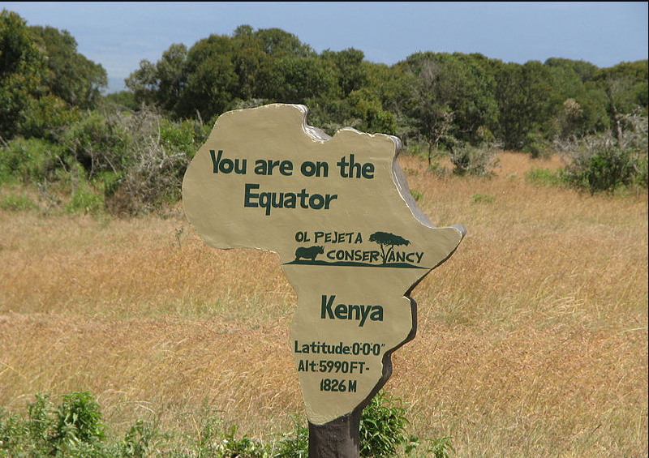

# myPyWeather Project

#### myPyWeather

Visualizes the weather of 500+ cities across the world of varying distance from the equator using  a simple python library called citipy, the [OpenWeatherMap API](https://openweathermap.org/api), and a little common sense to create a representative model of weather across world cities.

Build a series of scatter plots to showcase the following relationships:

- Temperature (F) vs. Latitude
- Humidity (%) vs. Latitude
- Cloudiness (%) vs. Latitude
- Wind Speed (mph) vs. Latitude

Requirements:

- Randomly select **at least** 500 unique (non-repeat) cities based on latitude and longitude.
- Perform a weather check on each of the cities using a series of successive API calls. 
- Include a print log of each city as it's being processed with the city number, city name, and requested URL.
- Save both a CSV of all data retrieved and png images for each scatter plot.

#### Technologies

- Uses Jupyter Notebooks, Matplotlib,  OWM API, Data Analysis to look at the weather is cities around the world .  

